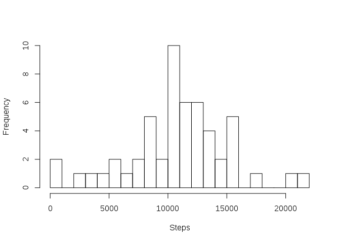
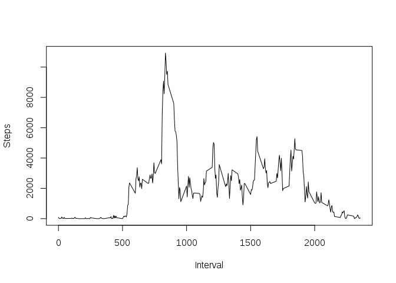
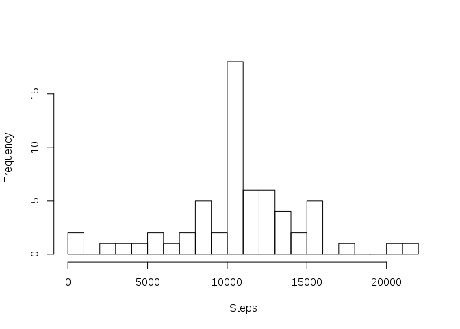
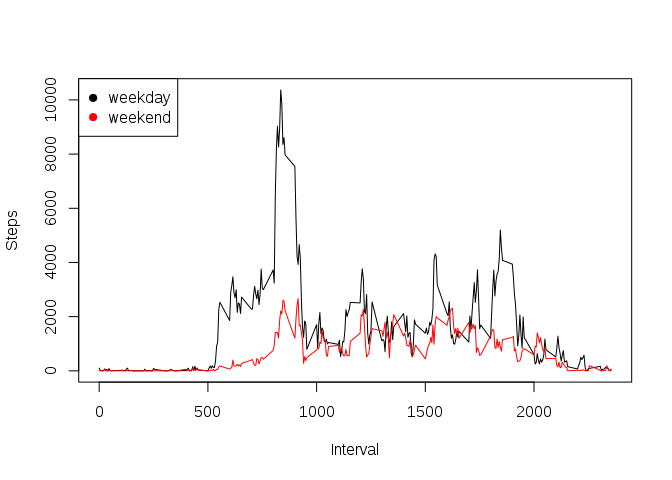

This is an R Markdown document and it will describe and show the code
for the course project:

-   Loading in the data set

<!-- -->

    data<-read.csv("activity.csv")

-   This calculates the total number of steps per day and shows a
    histogram plot of the result

<!-- -->

    data$date<-factor(data$date)
    data_clean<-data[complete.cases(data),]
    data_steps<-setNames(aggregate(data_clean$steps, list(data_clean$date), sum), c("Date","Steps"))
    hist(data_steps$Steps,main="",xlab="Steps",breaks=30)

-   Calculating the mean and the median of the total number of steps per
    day

<!-- -->

    mean<-as.numeric(mean(data_steps$Steps))
    median<-as.numeric(median(data_steps$Steps))

Mean: 10766.19  
Median: 10765

-   This calculates the activity pattern by 5-minute intervall and plots
    a time series

<!-- -->

    data_inter<-setNames(aggregate(data_clean$steps, list(data_clean$interval), sum), c("Interval","Steps"))
    plot(data_inter$Interval,data_inter$Steps,type="l",ylab="Steps",xlab="Interval")

-   This finds the interval with the highest number of steps

<!-- -->

    int<-data_inter[which.max(data_inter$Steps),1]

Highest Interval in \#835

\*Now the missing values will be adressed There are

    nrow(data)-nrow(data_clean)

    ## [1] 2304

missing values

\*Missing values will be replaced by the mean value of the respective
5-min interval

    data_fil<-data
    data_inter_mean<-setNames(aggregate(data_clean$steps, list(data_clean$interval), mean), c("Interval","Steps"))
    for(i in 1:nrow(data_fil)){
      if (is.na(data_fil[i,1])) {
          data_fil[i, 1] <- data_inter_mean[data_inter_mean$Interval==data_fil[i,3],2]
      }
    }

-   This calculates the total number of steps per day and shows a
    histogram plot of the result

<!-- -->

    data_steps_fil<-setNames(aggregate(data_fil$steps, list(data_fil$date), sum), c("Date","Steps"))
    hist(data_steps_fil$Steps,main="",xlab="Steps",breaks=30)

-   Calculating the mean and the median again for the “complete” data

<!-- -->

    mean<-as.numeric(mean(data_steps_fil$Steps))
    median<-as.numeric(median(data_steps_fil$Steps))

Mean: 10766.19  
Median: 10766.19

These averaged values stay nearly the same, but this increases the
confidence of these values due to higher frequency

-   Calculating difference between weekdays and weekends

<!-- -->

    data_fil$Weekday<-weekdays(as.Date(data_fil$date,format="%Y-%m-%d"),abbreviate=TRUE)
    data_fil$Weekday[data_fil$Weekday=="Sat" | data_fil$Weekday=="Sun"] <- "weekend"
    data_fil$Weekday[data_fil$Weekday!="weekend"] <- "weekday"
    data_fil$Weekday<-factor(data_fil$Weekday)

-   This calculates the activity pattern by 5-minute intervall summed up
    for weekends and weekdays and plots a time series

<!-- -->

    data_inter<-setNames(aggregate(data_fil$steps, list(data_fil$interval,data_fil$Weekday), sum), c("Interval","Weekday","Steps"))
    plot(data_inter$Interval[data_inter$Weekday=="weekday"],data_inter$Steps[data_inter$Weekday=="weekday"],type="l",ylab="Steps",xlab="Interval",col=1)
    lines(data_inter$Interval[data_inter$Weekday=="weekend"],data_inter$Steps[data_inter$Weekday=="weekend"],col=2)
    legend("topleft",legend=unique(data_inter$Weekday),col=1:length(data_inter$Weekday),pch=19)

